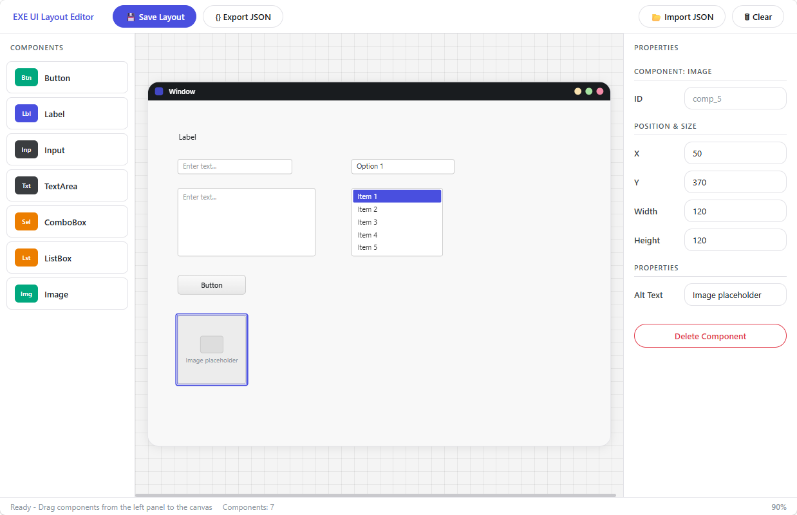

# EXE UI Layout Editor

A single-file HTML visual layout editor for designing desktop-style (EXE) application interfaces. Built for collaborating with AI agents on UI design details.

Open `exe-layout-editor.html` directly in any modern browser — no build step, no server, no dependencies.

## Features

### Canvas
- Central 800x600 simulated window with title bar as the layout container
- Grid background for visual alignment
- Ctrl + Mouse wheel to zoom in/out (25%–300%), click the zoom indicator to reset

### Component Palette (Left Panel)
Drag components from the left panel onto the canvas window:

| Component | Description |
|-----------|-------------|
| **Button** | Clickable button with configurable text |
| **Label** | Static text label with adjustable font size |
| **Input** | Single-line text input with placeholder |
| **TextArea** | Multi-line text area, supports read-only mode |
| **ComboBox** | Dropdown selector with comma-separated options |
| **ListBox** | Scrollable list with selectable items |
| **Image** | Image placeholder with alt text |

### Properties Panel (Right Panel)
- Click the canvas window background to edit window properties (title, width, height)
- Click a placed component to edit its position, size, and type-specific properties
- All changes render instantly on the canvas

### Interactions
- **Drag from palette** — creates a new component at the drop position
- **Drag inside canvas** — reposition components freely
- **Delete / Backspace** — remove the selected component
- **Escape** — deselect

### Export & Import
- **Save Layout** — exports a self-contained HTML file with structured comments and `data-*` attributes, easy for AI agents to parse
- **Export JSON** — exports the layout state as JSON for programmatic consumption
- **Import JSON** — restore a previously exported layout

## AI Agent Integration

The exported HTML and JSON formats are designed to be machine-readable:

- Each component carries `data-type`, `data-x`, `data-y`, `data-width`, `data-height` attributes
- Component-specific properties are stored as additional `data-*` attributes
- HTML comments annotate every component with a summary line (type, ID, position, size)
- JSON output preserves the full layout state as a plain object

## Design System

The editor UI follows the design tokens defined in [`DESIGN.md`](./DESIGN.md), adapted for a light-mode tool interface. Key tokens used:

- **Accent**: Cobalt violet (`#494fdf`) for selections and primary actions
- **Surface**: White (`#ffffff`) panels on soft gray (`#f4f4f4`) canvas
- **Typography**: Inter font family
- **Shapes**: Pill buttons (`border-radius: 9999px`), rounded-12 inputs, rounded-20 cards

## License

MIT
